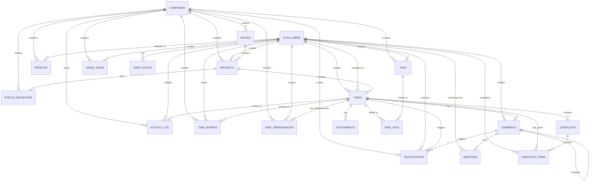

# TaskFlow - Task & Project Management Application

## 1. Project Topic, Scope, Description & Goal

### Topic
**TaskFlow** is a comprehensive task and project management application designed for small to medium-sized teams to collaborate, organize, and track their work efficiently.

### Scope
TaskFlow provides a complete solution for:
- Multi-tenant project management with company-based organization
- Task tracking with advanced workflow management
- Real-time collaboration and communication
- Team member management with role-based access control
- Comprehensive analytics and reporting
- Time tracking and productivity monitoring

### Description
TaskFlow is a modern, feature-rich task management platform built with vanilla JavaScript and Vite. It enables teams to:
- Organize work across multiple projects and spaces
- Track tasks through custom workflow statuses
- Collaborate in real-time with comments, mentions, and activity logs
- Monitor productivity with time tracking and analytics
- Manage team members with granular permission levels

### Goal
To provide a lightweight, efficient, and user-friendly alternative to enterprise project management tools, enabling small teams to:
- Increase productivity and visibility
- Improve team collaboration and communication
- Track project progress and team performance
- Maintain data security with role-based access control
- Scale effortlessly as the team grows

---

## 2. App Features

### Core Features
- **Project Management**
  - Create, edit, and delete projects
  - Organize projects with spaces
  - Set project status (active, paused, archived)
  - Track project duration with start/end years
  

- **Task Management**
  - Full CRUD operations on tasks
  - Assign tasks to team members
  - Set priorities (low, medium, high)
  - Kanban board view with drag-and-drop
  - Custom workflow statuses
  - Subtasks and checklists for detailed task breakdown

- **Collaboration Features**
  - Threaded comments with @mentions
  - Action items within comments
  - Real-time activity log tracking all changes
  - Notification system for assignments and mentions
  

- **Time Tracking**
  - Manual time entry creation
  - Prevent overlapping timers
  - Total time aggregation per task/user

- **Organization & Tagging**
  - Create and assign tags/labels to tasks
  - Admin-only tag creation
  - Filter tasks by tags
  - Tag usage analytics

- **Analytics & Reporting**
  - Task completion metrics
  - Status and priority distribution
  - Overdue task identification
  - Time tracking summary reports
  - Team productivity metrics
  - PDF export functionality
  - Date range and project-based filtering

- **Team Management**
  - Company-based team organization
  - Two role levels: admin, user
  - Admin panel for team member management
  - User management and role assignment

- **Dashboard**
  - Overview widgets showing key metrics
  - Recent activity feed
  - Quick access to projects and tasks
  - Personalized user information

---

## 3. Technologies, Stack & Architecture

### Technology Stack

#### Frontend
- **Framework**: Vanilla JavaScript (ES6+)
- **Build Tool**: Vite
- **UI Framework**: Bootstrap 5
- **Styling**: CSS3
- **Real-time Updates**: Supabase Realtime
- **Testing**: Vitest with Playwright

#### Backend
- **Database**: PostgreSQL (via Supabase)
- **Authentication**: Supabase Auth (JWT-based)
- **Real-time Database**: Supabase Realtime subscriptions
- **Edge Functions**: Deno-based serverless functions
- **API**: RESTful API (Supabase PostgREST)

#### Infrastructure
- **Hosting**: Supabase Cloud
- **CDN**: Supabase CDN for static assets
- **Database Migrations**: Custom SQL migrations

### Architecture Overview

#### Multi-Page Application (MPA) Structure
```
Frontend Root (frontend/ with Vite)
├── HTML Pages (Vite entry points - processed by build)
│   ├── index.html (Landing/Bootstrap)
│   ├── signin.html (Authentication)
│   ├── signup.html (Registration)
│   ├── dashboard.html (User Overview)
│   ├── projects.html (Project Management)
│   ├── tasks.html (Task Board)
│   ├── admin.html (Admin Panel)
│   ├── profile.html (User Profile)
│   └── reports.html (Analytics)
├── src/features/ (Feature-based modules)
│   ├── landing/           # Landing page feature
│   ├── auth/              # Auth pages (signin, signup)
│   ├── projects/          # Project management
│   ├── tasks/             # Task board
│   ├── dashboard/         # Dashboard
│   ├── admin/             # Admin panel
│   ├── reports/           # Analytics
│   ├── comments/          # Comments system
│   ├── time-tracking/     # Time tracking
│   └── notifications/     # Notifications
├── src/shared/ (Shared across features)
│   ├── services/          # API/business logic
│   ├── components/        # Reusable components
│   ├── utils/             # Helper functions
│   └── constants/         # Enums & constants
├── src/styles/ (CSS organization)
│   ├── global/            # Bootstrap, variables
│   ├── shared/            # Component CSS
│   └── features/          # Feature-specific CSS
└── src/assets/            # Static files
```

#### Multi-Tenant Architecture
- **Company-based Isolation**: Each company operates independently
- **Row-Level Security (RLS)**: PostgreSQL RLS policies enforce data isolation
- **Role-Based Access Control (RBAC)**: Three-tier permission model
  - `sys_admin`: System-level administration - only one for the app
  - `admin`: Company-level administration
  - `user`: Standard team member

#### Authentication Flow
1. User registers/signs in via Supabase Auth
2. JWT token stored in browser
3. All API requests include JWT in Authorization header
4. RLS policies validate user access at database level

#### Real-time Communication
- Supabase Realtime subscriptions for live updates
- Event-driven architecture for state synchronization
- Automatic notifications on task/comment updates

---

## 4. App Development Processes

### Planning & Design Phase
1. **Requirements Gathering**: Identified core features for MVP
2. **Database Schema Design**: Normalized PostgreSQL schema with proper relationships
3. **User Story Creation**: Defined user workflows and interactions
4. **Wireframing**: Designed UI layouts and user flows
5. **Architecture Design**: Planned multi-tenant, multi-page architecture

### Development Steps

#### Phase 1: Core Foundation
- **1A: Spaces** - Organize projects into logical spaces
- **1B: Custom Statuses** - Support custom workflow statuses per company
- **1C: Subtasks & Checklists** - Task decomposition capabilities
- **1D: Dashboard** - User overview and quick metrics
- **1E: Sidebar** - Navigation and project tree

#### Phase 2: Collaboration
- **2A: Comments & Mentions** - Threaded discussions with @mentions
- **2B: Activity Log** - Automatic change tracking with PostgreSQL triggers
- **2C: Notifications** - Real-time notifications for assignments and mentions
- **2D: Team Members** - Team member management and organization

#### Phase 3: Advanced Features
- **3A: Time Tracking** - Timer and manual time entry tracking
- **3B: Tags/Labels** - Flexible task organization
- **3C: Reports & Analytics** - Comprehensive analytics dashboard

#### Phase 4: Optimization
- **N+1 Query Fixes**: 51 queries → 1 RPC (51x reduction for tag counts)
- **CLS Optimization**: Layout shift score 0.29 → <0.05 (83% improvement)
- **Performance Tuning**: Parallel data loading, lazy loading, caching

#### Phase 5: Refactoring
- **Service Standardization**: All 20 services converted to object pattern
- **Utility Standardization**: All 7 utils converted to object pattern
- **Feature-Based Organization**: All 17 page scripts moved to feature folders
- **CSS Reorganization**: 33 CSS files organized by feature

### Development Workflow
- **Version Control**: Git with feature branching
- **Code Organization**: Feature-based folder structure
- **Naming Conventions**: camelCase for functions, kebab-case for files
- **Code Review**: Manual review of pull requests
- **Documentation**: Inline comments for complex logic

### Testing Strategy

#### Unit Tests
- Service layer testing with Vitest
- Database query validation
- Business logic verification

#### Integration Tests
- API endpoint testing with Playwright
- CRUD operation validation
- Permission and RLS policy testing

#### E2E Tests
- User workflow validation
- Multi-page navigation testing
- Real-time feature testing


## 5. Project Structure

```
PM/
├── frontend/                          # Frontend application (Vite root)
│   ├── src/
│   │   ├── features/                 # Feature-based modules
│   │   │   ├── projects/
│   │   │   │   ├── pages/            # Page scripts (tasks.js, dashboard.js, etc.)
│   │   │   │   ├── services/         # Business logic
│   │   │   │   ├── components/       # UI components
│   │   │   │   └── styles/           # Feature CSS
│   │   │   ├── tasks/
│   │   │   ├── comments/
│   │   │   ├── time-tracking/
│   │   │   ├── notifications/
│   │   │   ├── reports/
│   │   │   ├── landing/
│   │   │   ├── auth/
│   │   │   ├── admin/
│   │   │   ├── dashboard/
│   │   │   └── ...
│   │   ├── shared/                   # Shared across features
│   │   │   ├── services/             # Service layer (project, task, etc.)
│   │   │   ├── components/           # Shared components (navbar, sidebar)
│   │   │   ├── utils/                # Utility functions (auth, validation)
│   │   │   └── constants/            # Constants and enums
│   │   ├── styles/                   # Global & shared styles
│   │   │   ├── global/               # Global CSS (bootstrap, variables)
│   │   │   ├── shared/               # Shared component CSS
│   │   │   └── features/             # Feature-specific CSS
│   │   └── assets/                   # Images, icons, static files
│   ├── public/                        # Static files served as-is
│   ├── index.html                     # Landing/bootstrap page (Vite entry)
│   ├── dashboard.html                 # Dashboard page (Vite entry)
│   ├── projects.html                  # Projects page (Vite entry)
│   ├── tasks.html                     # Tasks board page (Vite entry)
│   ├── admin.html                     # Admin panel page (Vite entry)
│   ├── profile.html                   # User profile page (Vite entry)
│   ├── signin.html                    # Sign in page (Vite entry)
│   ├── signup.html                    # Registration page (Vite entry)
│   ├── reports.html                   # Reports page (Vite entry)
│   ├── tests/                         # Test files
│   │   ├── unit/                      # Unit tests
│   │   ├── integration/               # Integration tests
│   │   └── e2e/                       # End-to-end tests
│   ├── vite.config.js                 # Vite configuration (defines HTML entries)
│   ├── package.json
│   └── .env                           # Environment variables
├── supabase/                          # Database migrations
│   ├── migrations/
│   │   ├── 20260208_001_initial_schema.sql
│   │   ├── 20260209_001_create_spaces.sql
│   │   ├── 20260210_*.sql
│   │   └── ...
│   └── functions/                     # Edge functions
│       └── admin-reset-password/
├── docs/                              # Documentation
│   ├── project-technical-summary.md
│   ├── coding-conventions.md
│   ├── security.md
│   └── ...
├── CLAUDE.md                          # Project instructions
└── README.md                          # This file
```

---

## 6. Database Schema

### Database Architecture Diagram (19 Tables)



### Core Tables

#### 1. Companies
**Purpose**: Multi-tenant company container for complete data isolation. Each company has its own projects, spaces, tasks, and team members. Enables the SaaS model where different organizations operate independently within the same platform.

```sql
CREATE TABLE companies (
  id BIGINT GENERATED ALWAYS AS IDENTITY PRIMARY KEY,
  name TEXT NOT NULL UNIQUE,
  logo_url TEXT,
  created_at TIMESTAMP DEFAULT NOW(),
  updated_at TIMESTAMP DEFAULT NOW()
);
```

**Key Fields**:
- `name`: Unique company identifier
- `logo_url`: Company branding/logo
- **Isolation**: All company data is accessed through `auth.user_company_id()` RLS function

#### 2. Users (via Supabase Auth)
**Purpose**: Authentication and user metadata storage. Leverages Supabase Auth for secure credential management while storing application-specific metadata in the auth.users table. Supports three roles: sys_admin (system administrator), admin (company administrator), and user (standard employee).

```
Metadata stored in auth.users:
- company_id (nullable - NULL = personal user)
- role ('sys_admin', 'admin', 'user')
- department
- avatar_url
```

**Key Points**:
- JWT-based authentication via Supabase
- Single sys_admin created via bootstrap modal during initial setup
- Each company can have multiple admins and users
- Multi-company support: users can belong to only one company

#### 3. Projects
**Purpose**: Top-level work containers that organize all tasks and activities. Projects can belong to spaces for hierarchical organization and support lifecycle management with status tracking (active, paused, archived).

```sql
CREATE TABLE projects (
  id BIGINT GENERATED ALWAYS AS IDENTITY PRIMARY KEY,
  name TEXT NOT NULL,
  description TEXT,
  company_id BIGINT REFERENCES companies(id) (nullable - personal projects),
  space_id BIGINT REFERENCES spaces(id),
  created_by UUID REFERENCES auth.users(id),
  status TEXT CHECK (status IN ('active', 'paused', 'archived')),
  color TEXT,
  icon TEXT,
  start_year INT,
  end_year INT,
  sort_order INT,
  created_at TIMESTAMP DEFAULT NOW(),
  updated_at TIMESTAMP DEFAULT NOW()
);
```

**Key Features**:
- Can be personal (company_id NULL) or company-owned
- Visual customization with color and icon
- Optional time-based tracking (start_year, end_year)
- Sort order for custom arrangement
- RLS enforced: users only see their company's projects

#### 4. Tasks
**Purpose**: Individual work items within projects. The core entity of the system, supporting assignment, status tracking, prioritization, and detailed tracking of work completion.

```sql
CREATE TABLE tasks (
  id BIGINT GENERATED ALWAYS AS IDENTITY PRIMARY KEY,
  title TEXT NOT NULL,
  description TEXT,
  project_id BIGINT REFERENCES projects(id),
  space_id BIGINT REFERENCES spaces(id),
  assigned_to UUID REFERENCES auth.users(id),
  created_by UUID REFERENCES auth.users(id),
  status TEXT NOT NULL,
  priority TEXT CHECK (priority IN ('low', 'medium', 'high')),
  due_date DATE,
  created_at TIMESTAMP DEFAULT NOW(),
  updated_at TIMESTAMP DEFAULT NOW()
);
```

**Key Relationships**:
- Belongs to a project and space
- Assigned to a team member
- Tracked by status (custom statuses per company)
- Priority levels: low, medium, high
- Has deadline tracking with due_date

#### 5. Spaces
**Purpose**: Logical grouping mechanism for organizing projects within a company. Enables hierarchical project organization (e.g., by department, product area, or initiative).

```sql
CREATE TABLE spaces (
  id BIGINT GENERATED ALWAYS AS IDENTITY PRIMARY KEY,
  name TEXT NOT NULL,
  description TEXT,
  company_id BIGINT REFERENCES companies(id),
  color TEXT,
  icon TEXT,
  sort_order INT,
  created_at TIMESTAMP DEFAULT NOW(),
  updated_at TIMESTAMP DEFAULT NOW()
);
```

**Key Features**:
- Company-scoped organization
- Visual customization (color, icon)
- Custom sort order for UI arrangement
- Projects and Tasks can be grouped within spaces

#### 6. Profiles
**Purpose**: User mapping table linking Supabase Auth users to companies with role assignment. Bridges authentication (auth.users) to application data (companies) with role-based access control.

```sql
CREATE TABLE profiles (
  id UUID PRIMARY KEY REFERENCES auth.users(id),
  company_id BIGINT REFERENCES companies(id) (nullable - personal users),
  role TEXT NOT NULL CHECK (role IN ('admin', 'user', 'sys_admin')),
  email TEXT,
  created_at TIMESTAMP DEFAULT NOW(),
  updated_at TIMESTAMP DEFAULT NOW()
);
```

**Key Features**:
- One-to-one mapping with auth.users
- Company association for multi-tenant support
- Role assignment (sys_admin, admin, user)
- Supports personal users (company_id NULL)
- Email cache for quick access

#### 7. Status Definitions
**Purpose**: Custom workflow status definitions per company/project. Allows each company to define their own status workflows (e.g., To Do → In Progress → Review → Done) instead of using fixed statuses.

```sql
CREATE TABLE status_definitions (
  id BIGINT GENERATED ALWAYS AS IDENTITY PRIMARY KEY,
  name TEXT NOT NULL,
  slug TEXT NOT NULL,
  color TEXT DEFAULT '#6b7280',
  sort_order INT DEFAULT 0,
  is_done BOOLEAN DEFAULT FALSE,
  is_default BOOLEAN DEFAULT FALSE,
  company_id BIGINT REFERENCES companies(id),
  project_id BIGINT REFERENCES projects(id),
  created_at TIMESTAMP DEFAULT NOW(),
  updated_at TIMESTAMP DEFAULT NOW()
);
```

**Key Features**:
- Company and project-scoped status definitions
- Visual color coding for UI distinction
- Custom ordering for workflow sequencing
- `is_done` flag to mark completion statuses
- `is_default` to set initial task status
- Slug for URL-friendly status names

#### 7. Comments
**Purpose**: Threaded discussion system on tasks. Supports rich collaboration with threading, action item tracking, and resolution status for comment-based tasks.

```sql
CREATE TABLE comments (
  id BIGINT GENERATED ALWAYS AS IDENTITY PRIMARY KEY,
  task_id BIGINT REFERENCES tasks(id) ON DELETE CASCADE,
  created_by UUID REFERENCES auth.users(id),
  content TEXT NOT NULL,
  parent_comment_id BIGINT REFERENCES comments(id) (for threading),
  is_action_item BOOLEAN DEFAULT FALSE,
  resolved BOOLEAN DEFAULT FALSE,
  created_at TIMESTAMP DEFAULT NOW(),
  updated_at TIMESTAMP DEFAULT NOW()
);
```

**Key Features**:
- Nested threaded discussions (parent_comment_id)
- Action item marking for task-like comments
- Resolution tracking
- Automatic cascade deletion with task

#### 8. Mentions
**Purpose**: Association table for tracking @mentions within comments. Enables notification triggering when users are mentioned and helps identify who was involved in discussions.

```sql
CREATE TABLE mentions (
  id BIGINT GENERATED ALWAYS AS IDENTITY PRIMARY KEY,
  comment_id BIGINT REFERENCES comments(id) ON DELETE CASCADE,
  mentioned_user_id UUID REFERENCES auth.users(id),
  created_at TIMESTAMP DEFAULT NOW()
);
```

**Key Purpose**:
- Links comments to mentioned users
- Triggers notifications for mentioned users
- Automatic cascade deletion with comment

#### 9. Task Tags
**Purpose**: Many-to-many junction table linking tasks to tags/labels. Enables flexible categorization and filtering of tasks across projects.

```sql
CREATE TABLE task_tags (
  task_id BIGINT REFERENCES tasks(id) ON DELETE CASCADE,
  tag_id BIGINT REFERENCES tags(id) ON DELETE CASCADE,
  PRIMARY KEY (task_id, tag_id)
);
```

**Key Purpose**:
- Flexible task categorization
- Multiple tags per task
- Enables filtering and reporting by tag

#### 10. Tags
**Purpose**: Reusable labels/categories for organizing and filtering tasks. Admin-created tags provide consistent categorization across the company.

```sql
CREATE TABLE tags (
  id BIGINT GENERATED ALWAYS AS IDENTITY PRIMARY KEY,
  name TEXT NOT NULL,
  color TEXT,
  company_id BIGINT REFERENCES companies(id),
  created_by UUID REFERENCES auth.users(id),
  created_at TIMESTAMP DEFAULT NOW()
);
```

**Key Features**:
- Company-scoped tags
- Visual color coding
- Admin-only creation (enforced via RLS)
- Support for task filtering and analytics

#### 11. Time Entries
**Purpose**: Tracks time spent on tasks. Supports both manual time entry and running timers, with automatic duration calculation and overlap prevention.

```sql
CREATE TABLE time_entries (
  id BIGINT GENERATED ALWAYS AS IDENTITY PRIMARY KEY,
  task_id BIGINT REFERENCES tasks(id),
  user_id UUID REFERENCES auth.users(id),
  start_time TIMESTAMP NOT NULL,
  end_time TIMESTAMP,
  duration_seconds INT,
  created_at TIMESTAMP DEFAULT NOW(),
  updated_at TIMESTAMP DEFAULT NOW()
);
```

**Key Features**:
- Per-task time tracking
- User-attributed time entries
- Automatic duration calculation
- Running timers (end_time NULL) and completed entries
- Supports reporting and productivity analytics

#### 12. Activity Log
**Purpose**: Automatic audit trail of all system changes. PostgreSQL triggers automatically log every create, update, and delete operation for compliance, debugging, and change history tracking.

```sql
CREATE TABLE activity_log (
  id BIGINT GENERATED ALWAYS AS IDENTITY PRIMARY KEY,
  entity_type TEXT NOT NULL,
  entity_id BIGINT NOT NULL,
  action TEXT NOT NULL,
  user_id UUID REFERENCES auth.users(id),
  company_id BIGINT REFERENCES companies(id),
  details JSONB,
  created_at TIMESTAMP DEFAULT NOW()
);
```

**Key Features**:
- Automatic trigger-based logging
- Tracks: projects, tasks, comments, tags, time entries
- Captures who made what change when
- JSONB details for full change history
- Company-scoped for isolation

#### 13. Notifications
**Purpose**: Real-time notification queue for user engagement events. Tracks assignments, mentions, and activity that requires user attention.

```sql
CREATE TABLE notifications (
  id BIGINT GENERATED ALWAYS AS IDENTITY PRIMARY KEY,
  user_id UUID REFERENCES auth.users(id),
  type TEXT NOT NULL,
  related_user_id UUID REFERENCES auth.users(id),
  task_id BIGINT REFERENCES tasks(id),
  comment_id BIGINT REFERENCES comments(id),
  read BOOLEAN DEFAULT FALSE,
  created_at TIMESTAMP DEFAULT NOW()
);
```

**Key Features**:
- User-scoped notifications
- Multiple notification types (assignment, mention, activity)
- Read/unread tracking
- Real-time Supabase subscriptions for live updates

#### 14. Checklists
**Purpose**: Container for checklist items within tasks. Enables detailed task decomposition for complex work items with progress tracking organized into named groups.

```sql
CREATE TABLE checklists (
  id BIGINT GENERATED ALWAYS AS IDENTITY PRIMARY KEY,
  task_id BIGINT REFERENCES tasks(id) ON DELETE CASCADE,
  title VARCHAR NOT NULL,
  sort_order INT DEFAULT 0,
  created_at TIMESTAMP DEFAULT NOW(),
  updated_at TIMESTAMP DEFAULT NOW()
);
```

**Key Features**:
- Per-task checklist groups
- Named checklist collections
- Sort order for custom arrangement
- Automatic cascade deletion with task
- Contains multiple checklist items

#### 15. Checklist Items
**Purpose**: Individual items within checklists. Tracks completion status, assignments, and due dates for granular task breakdown.

```sql
CREATE TABLE checklist_items (
  id BIGINT GENERATED ALWAYS AS IDENTITY PRIMARY KEY,
  checklist_id BIGINT REFERENCES checklists(id) ON DELETE CASCADE,
  content VARCHAR NOT NULL,
  is_completed BOOLEAN DEFAULT FALSE,
  completed_at TIMESTAMP,
  completed_by UUID REFERENCES auth.users(id),
  assigned_to UUID REFERENCES auth.users(id),
  due_date TIMESTAMP,
  sort_order INT DEFAULT 0,
  created_at TIMESTAMP DEFAULT NOW(),
  updated_at TIMESTAMP DEFAULT NOW()
);
```

**Key Features**:
- Individual checklist items with content
- Completion tracking with timestamp and completer
- Assignment to team members
- Per-item due dates
- Sort order for custom arrangement
- Auto cascade with checklist deletion

#### 16. Attachments
**Purpose**: File uploads and document management for tasks. Stores metadata for files uploaded to task details with size tracking and upload attribution.

```sql
CREATE TABLE attachments (
  id BIGINT GENERATED ALWAYS AS IDENTITY PRIMARY KEY,
  company_id BIGINT REFERENCES companies(id),
  task_id BIGINT REFERENCES tasks(id) ON DELETE CASCADE,
  file_name TEXT NOT NULL,
  file_path TEXT NOT NULL,
  file_size BIGINT NOT NULL CHECK (file_size > 0),
  mime_type TEXT,
  uploaded_by UUID REFERENCES auth.users(id),
  created_at TIMESTAMP DEFAULT NOW()
);
```

**Key Features**:
- Per-task file attachments
- File metadata (name, size, mime type)
- Upload attribution and timestamps
- File path for storage reference
- Company-scoped isolation
- Auto cascade with task deletion

#### 17. Task Dependencies
**Purpose**: Task blocking and scheduling relationships. Enables dependency management for Gantt chart scheduling with multiple relationship types (finish-to-start, start-to-start, etc.).

```sql
CREATE TABLE task_dependencies (
  id BIGINT GENERATED ALWAYS AS IDENTITY PRIMARY KEY,
  company_id BIGINT REFERENCES companies(id),
  task_id BIGINT REFERENCES tasks(id) ON DELETE CASCADE,
  depends_on_task_id BIGINT REFERENCES tasks(id) ON DELETE CASCADE,
  dependency_type VARCHAR DEFAULT 'finish_to_start'
    CHECK (dependency_type IN ('finish_to_start', 'start_to_start', 'finish_to_finish', 'start_to_finish')),
  created_by UUID REFERENCES auth.users(id),
  is_auto BOOLEAN DEFAULT FALSE,
  created_at TIMESTAMP DEFAULT NOW()
);
```

**Key Features**:
- Task blocking relationships
- Multiple dependency types for scheduling
- Gantt chart integration (`is_auto` for auto-generated)
- Creator attribution
- Company-scoped isolation

#### 18. User Status
**Purpose**: Real-time user presence and availability tracking. Tracks online status, away status, and last-seen timestamps for team collaboration visibility.

```sql
CREATE TABLE user_status (
  user_id UUID PRIMARY KEY REFERENCES auth.users(id),
  status TEXT DEFAULT 'offline'
    CHECK (status IN ('online', 'away', 'busy', 'offline')),
  status_message TEXT,
  last_seen TIMESTAMP DEFAULT NOW(),
  updated_at TIMESTAMP DEFAULT NOW()
);
```

**Key Features**:
- Real-time user availability status
- Optional status messages ("In a meeting", "On vacation", etc.)
- Last-seen timestamp for presence tracking
- Automatically updated on user activity

#### 19. Saved Views
**Purpose**: User-defined saved task filter views. Enables users to create, save, and quickly load custom filtered task views without recreating filters.

```sql
CREATE TABLE saved_views (
  id BIGINT GENERATED ALWAYS AS IDENTITY PRIMARY KEY,
  user_id UUID REFERENCES auth.users(id),
  company_id BIGINT REFERENCES companies(id),
  name VARCHAR NOT NULL CHECK (TRIM(name) <> ''),
  filters JSONB DEFAULT '{}',
  is_default BOOLEAN DEFAULT FALSE,
  sort_order INT DEFAULT 0,
  created_at TIMESTAMP DEFAULT NOW(),
  updated_at TIMESTAMP DEFAULT NOW()
);
```

**Key Features**:
- Per-user saved filter views
- JSON filter criteria storage
- Set default view per user
- Sort order for view list arrangement
- Company-scoped access

### Complete Table Reference (19 Tables)

| # | Table | Purpose | Rows |
|---|-------|---------|------|
| 1 | companies | Multi-tenant company containers | 3 |
| 2 | profiles | User to company mapping with roles | 5 |
| 3 | projects | Work containers organized by spaces | 121 |
| 4 | spaces | Logical project grouping | 3 |
| 5 | tasks | Individual work items | 133 |
| 6 | checklists | Checklist groups within tasks | 7 |
| 7 | checklist_items | Individual checklist items | 14 |
| 8 | comments | Threaded task discussions | 61 |
| 9 | mentions | @mentions within comments | 0 |
| 10 | status_definitions | Custom workflow statuses | 483 |
| 11 | tags | Task labels/categories | 4 |
| 12 | task_tags | Many-to-many task-tag junction | 2 |
| 13 | attachments | File uploads on tasks | 1 |
| 14 | time_entries | Time tracking entries | 1 |
| 15 | task_dependencies | Task blocking relationships | 2 |
| 16 | activity_log | Audit trail of all changes | 846 |
| 17 | notifications | User notifications queue | 1 |
| 18 | user_status | Real-time user presence | 0 |
| 19 | saved_views | User-saved filter views | 0 |

### Key Database Features
- **Row-Level Security (RLS)**: All 19 tables have RLS policies enabled
- **PostgreSQL Triggers**: Auto-calculate durations, track activity, generate notifications
- **Helper Functions**: `is_system_admin()`, `user_company_id()`, `is_company_admin()`
- **Performance**: Indexes on foreign keys, company_id, and frequently queried columns
- **Data Type Standards**:
  - PKs: `bigint GENERATED ALWAYS AS IDENTITY` (except profiles/user_status which use uuid)
  - User references: `uuid` (from auth.users)
  - Company/Project/Task IDs: `bigint`
- **Multi-Tenancy**: Company-scoped isolation via RLS on all tenant-aware tables
- **Cascade Deletes**: Attachments, comments, checklists, and checklist_items auto-delete with parent

---

